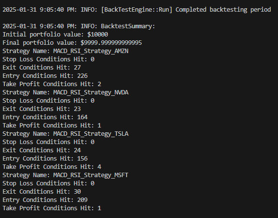

# QuantAssembly.Backtest

This is the backtesting framework that uses much of the same components as the main application to simulate trades. It uses the same configuration file as the main application and can be set up in much the same way. After which, you can simply change directory to the QuantAssembly.Backtest project root and run `dotnet run`.

It pulls the relevant historical data using the Alpaca Markets API and computes the indicator values for each time step. Please note for long time frames or large number of tickers, this precompute step can take a few minutes. The actual simulation loop is a synchronous process so it can take even longer if your strategy makes frequent transactions. 

I suggest grabbing a cup of coffee while it runs.

It simulates the same functionality as the main application as closely as possible for each time step.

The **BackTestTradeManager** records transactions in the ledger file in exactly the same way as the main application, mocking only the actual buy/sell order. This allows for consistent output between the two applications and makes it possible for [QuantAssembly.Dashboard](../QuantAssembly.Dashboard/readme.md) to visualize the performance of both live and backtested strategies without caring about distinguishing between them.

Running the application will carry out the simulation and log completion and a summary of the results. You can then take the ledger file generated and use the dashboard applications to visualize the results.



## Disclaimer
The backtesting application currently does **not** simulate transaction costs and slippage. I hope to add those fairly soon. Until then, please keep in mind the performance of your strategy can vary dramatically when it accounts for transaction costs and slippage.

## Architecture

- **Backtest Engine**: This is backtesting equivalent of the **Quant** class in the main application. They both function in much the same way, in fact, one of my next goals is to refactor the two to share a common module.

    It serves as an entry point to the application similar to its live counter-part.
    ```csharp
    public class Program
        {
            public static async Task Main(string[] args)
            {
                var timePeriod = TimePeriod.OneYear;
                var stepSize = StepSize.ThirtyMinutes;
                var backTestEngine = new BackTestEngine(timePeriod, stepSize);
                await backTestEngine.Run();
            }
        }
    ```
    The **TimePeriod** defines the time span to run the simulation through, in the above case, it would simulate the strategy for the last year. **StepSize** is the time interval for each iteration. While it is possible to have much shorter step sizes, one must bear in mind that it will increase the time taken for the precompute step. It is recommended to decrease the time period in that case. 

    Note: These parameters will likely be moved soon to being command line params or in the configuration file.

- **BacktestMarketDataProvider**: This implements both **IMarketDataProvider** and **IHistoricalMarketDataProvider** and uses data generated during the precompute step to simulate the data providers. 

## Example appsettings.json file

```json
{
    "AccountId": "BacktestAccount",
    "EnableDebugLog": "false",
    "LogFilePath": "app.log",
    "LedgerFilePath": "ledger.json",
    "PollingIntervalInMs": "30000",
    "TickerStrategyMap": {
        "AMZN": "Strategy/MACD_RSI_Strategy_AMZN.json",
        "MSFT": "Strategy/MACD_RSI_Strategy_MSFT.json",
        "NVDA": "Strategy/MACD_RSI_Strategy_NVDA.json",
        "TSLA": "Strategy/MACD_RSI_Strategy_TSLA.json"
    },
    "CacheFolderPath": "C:/Users/adith/Documents",
    "APIKey": "<alpha_vantage_api_key", // deprecated
    "RiskManagement": {
        "GlobalStopLoss": 5000,
        "MaxDrawDownPercentage": 0.6
    },
    "CustomProperties": {
        "AlpacaMarketsClientConfig": {
            "apiKey": "<api_key>",
            "apiSecret": "<api_secret>"
        },
        "PercentageAccountValueRiskManagerConfig": {
            "MaxTradeRiskPercentage": 0.1
        },
        "BacktestConfig": {
            "InitialPortfolioValue": 10000
        }
    }
}
```

## Future Improvements
- Simulate transaction costs and slippage
- Optimize performance