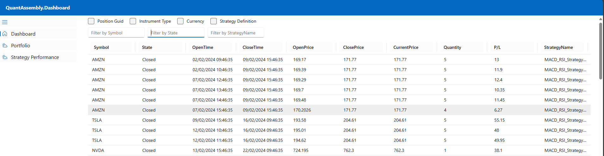
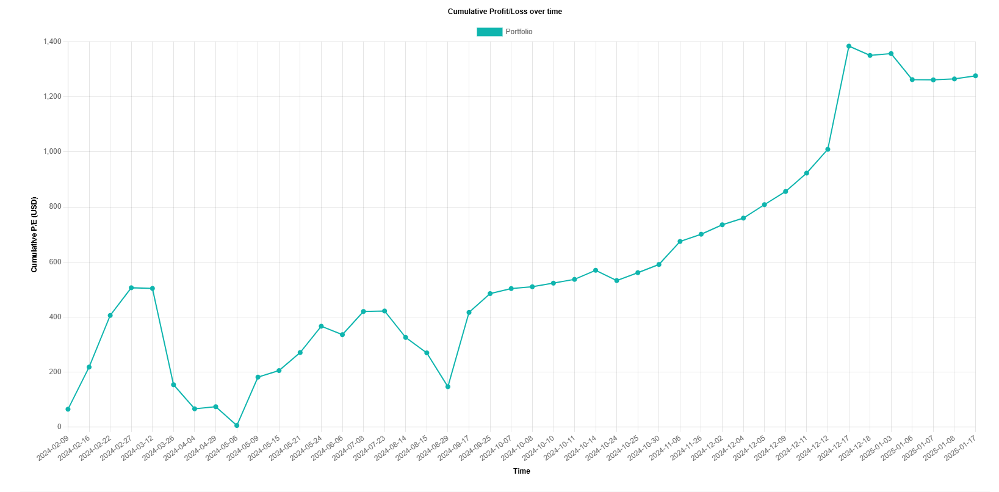
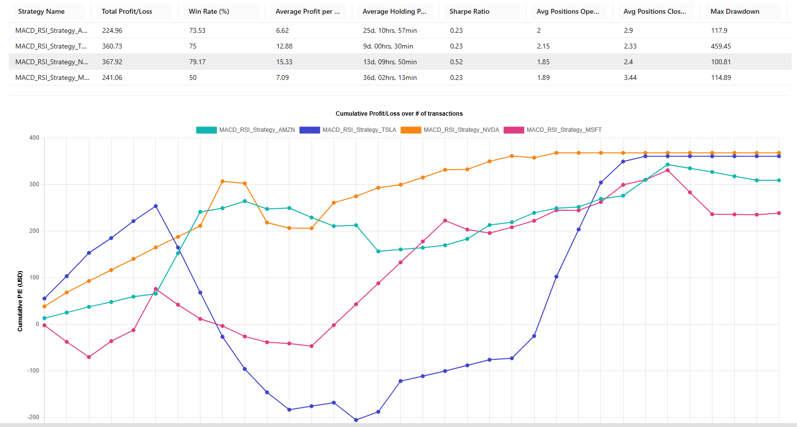
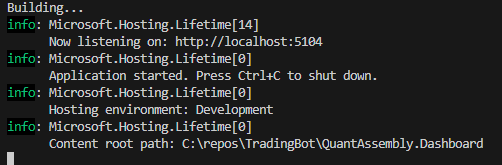

# QuantAssembly.Dashboard

This is a companion app to **QuantAssembly** and **QuantAssembly.BackTest** and allows you to visualize the performance of strategies whether live or backtested. 

It is a Blazor WASM app and uses the ledger file generated by both applications to power its various visualizations and insights.

This is still **very** early in development and is only meant to be a barebones solution. The author does not intend to refine it more than absolutely necessary.

There are 3 main pages for the app:

## Dashboard

This page lists out all the trades recorded in the ledger file, with options for basic filtering and sorting.

## Portfolio

This page is for the performance of the portfolio as a whole. 

## Strategy Performance

This page provides summaries of the performance of individual strategies and allows you to compare different strategies.

## Build and run
- Change directory to the QuantAssembly.Dashboard project root folder
- Run `dotnet build`
- Run `dotnet run`
- Open a browser tab and navigate to the local host url specified in the console.

## Future Improvements
- More metrics for strategy performance
- Paging support for large ledger files
- Properly handle state management so refresh actually works
- More metrics for portfolio performance
